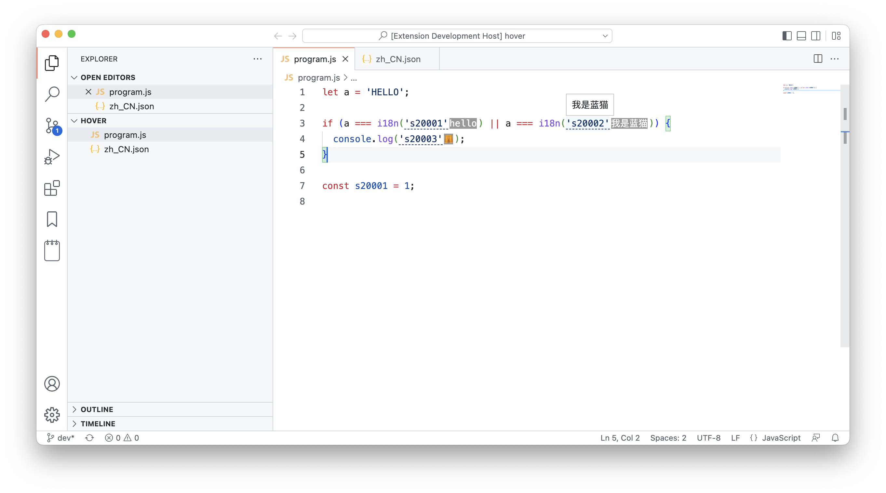

# naive-i18n README

[](https://creativecommons.org/licenses/by-nc/4.0/)
[](https://github.com/gnosis23/vscode-naive-i18n/releases)
[](https://marketplace.visualstudio.com/items?itemName=BohaoWang.naive-i18n)

Add hover texts to your i18n words.



## Getting Started
run `n18n: setup` command (`F1`) to set the file location of your i18n words.

## I18n words file Examples
### JSON
`JSON` format is recommended:

```json
{
  "s20001": "hello",
  "s20002": "我是蓝猫"
}
```

### JS (experimental)
We also support js file which export a default object. 

```js
// some logic

export default {
  "s20001": "hello",
  "s20002": "我是蓝猫"
}
```

## Extension Settings

This extension contributes the following settings:

* `n18n.location`: i18n file location

## Known Issues

Calling out known issues can help limit users opening duplicate issues against your extension.

## Release Notes

## License

This work is licensed under a [Creative Commons Attribution-NonCommercial 4.0 International License](https://creativecommons.org/licenses/by-nc/4.0/).
