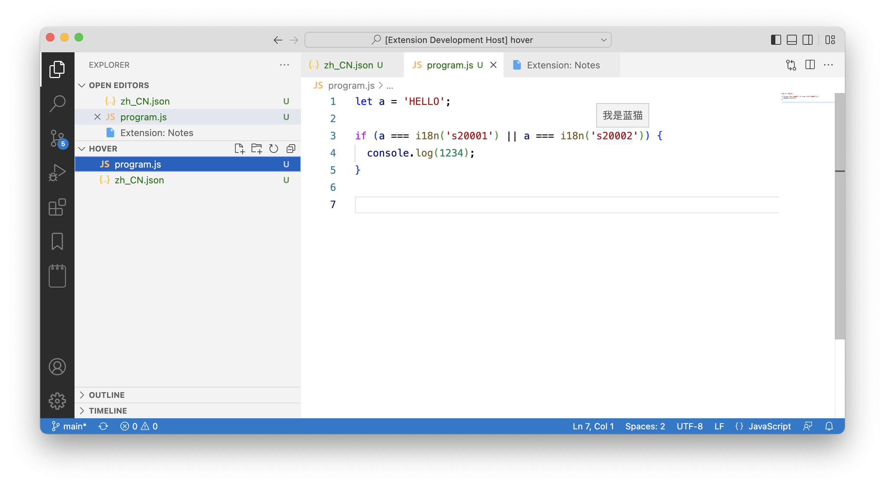

# naive-i18n README
Add hover texts to your i18n words.



## Getting Started
set the i18n text location (run `n18n: setup`, then reload)

example i18n config file:
```json
{
  "s20001": "hello",
  "s20002": "我是蓝猫"
}
```

## Extension Settings

This extension contributes the following settings:

* `n18n.location`: i18n JSON file location

## Known Issues

Calling out known issues can help limit users opening duplicate issues against your extension.

## Release Notes

